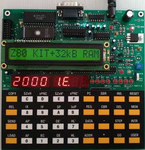

## Hi This is Dohwan

You can use the [editor on GitHub](https://github.com/onewaylight/engineering/edit/master/README.md) to maintain and preview the content for your website in Markdown files.

- Embedded System

  - My first embedded traing kit. looks like this one, it was long long time ago almost 30 years
  
     
    
    https://www.kswichit.com/Z80/Z80.html

- Windows Application 
  - GW Basic(Built in MS-DOS)
  - Quick Basic(I think it was first compiled basic compiler language? I couldn't remember exactly. It was long time ago!!!)
  - Turbo C/C++ (Borland)
  - Borland C/C++
  - MS Visual Studio 
  - Visual Studio C/C++, MFC 
  - C/C++ Std 17, 20
  - Java Not too much
  - C# .Net and .NetFramework.
    - Prism Framework
    - MVVM
    - Metro Library
    - DevExpress
    - CSLA Enterprise Business Framework
    - DI & IoC Mechanism
    - AOP
    - Recommended C# Books and References.
      - C# in Depth
      - CLR via C# 
      - Effective C# 50 Specific Ways to Improve Your C#
      - Concurrency in C#
      - Building Machine Learning Powered Applications-Going from Idea to Poduct
      - Building Enterprise Applications with Windows Presentation Foundation and the Model View ViewModel Pattern

- 3D Printer
- Android Native Application
- Kotlin 
